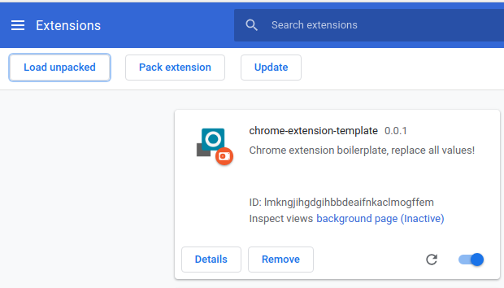

# xe.gr - Ignore Ad (The missing functionality)

## Introduction
This extension adds an "ignore" button at the bottom of each ad, so it helps to ignore this ad permanently on current browser.

Not the most fancy solution, but it's gonna help when you see the same ads every day and you are searching for months.

## Installation

Install dependencies:

```
yarn install
```

## Usage

To run a development server that will watch for file changes and rebuild the scripts, run:

```
yarn start
```

To just build the files without the development server:

```
yarn build
```

Both commands will create a `dist/` directory, it will contain the built files that should be loaded into the browser or packed.

## Load into Chrome

To load the built files into Chrome, open [chrome://extensions/](chrome://extensions/).

Enable "Developer mode" if it's not enabled yet:


Click on "Load unpacked":


Find the `dist/` directory on your system and open it.

The extension should be now at the top of the page:



## Publishing

[Follow the official docs](https://developer.chrome.com/webstore/publish) to learn how to publish a Chrome extension.
Please note that Google has its own process to review public extensions and using this boilerplate **does not guarantee** that the extension will pass it. Passing the review process is your responsibility!

## External resources

*   [Sample extension built with this template](https://github.com/edrpls/social-network-alert)

*   [Chrome Developer Documentation](https://developer.chrome.com/extensions/devguide)

*   [Overview slides about Chrome Extensions](https://github.com/edrpls/chrome-extensions-what-why-how)
